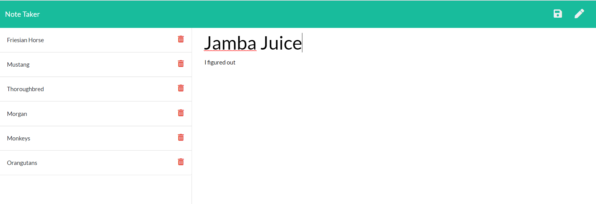

# Taker-Of-Notes

Express Note Taking Application!

## Table of contents

- [General info](#general-info)
- [Technologies](#Technologies)
- [User Story](#User-Story)
- [Summary](#Summary)

## General Info

This project was an example using Express to create a CLI to take notes and then save them and then also delete them. This project was developing the back-end logic and the functionality behind the files. It was tying all of the various files together and making sure they were all communicating together.

GitHub URL:

## Technologies

Project is created with :

- [JavaScript](https://www.javascript.com/)
- [Nodemon](https://nodemon.io/)
- [JSON](https://www.json.org/json-en.html)

## User Story

As a user with a busy life full of work, school, robots, animals, Pathfinder, rock climbing and trail running, I often find myself needing to remember many different schedules and places that I need to be. I can't remember all those things in this leaky vessel of a mind!
This application will enable me to always have something that saves all of my notes and things that are about to happen in my life and then as soon as I complete them I can delete them!

## Screenshot

## Summary

A person can type in a note title and then also also paragraphs of information that they would like to store in notes. The information they wrote down can then be stored and after hitting the save button on the top right corner and upon doing that the note they just made will save into a column on the left hand side of the page

## Authors

- Esther Walker

## LICENSE

MIT License

Copyright (c) 2020 Esther Walker

Permission is hereby granted, free of charge, to any person obtaining a copy
of this software and associated documentation files (the "Software"), to deal
in the Software without restriction, including without limitation the rights
to use, copy, modify, merge, publish, distribute, sublicense, and/or sell
copies of the Software, and to permit persons to whom the Software is
furnished to do so, subject to the following conditions:

The above copyright notice and this permission notice shall be included in all
copies or substantial portions of the Software.

THE SOFTWARE IS PROVIDED "AS IS", WITHOUT WARRANTY OF ANY KIND, EXPRESS OR
IMPLIED, INCLUDING BUT NOT LIMITED TO THE WARRANTIES OF MERCHANTABILITY,
FITNESS FOR A PARTICULAR PURPOSE AND NONINFRINGEMENT. IN NO EVENT SHALL THE
AUTHORS OR COPYRIGHT HOLDERS BE LIABLE FOR ANY CLAIM, DAMAGES OR OTHER
LIABILITY, WHETHER IN AN ACTION OF CONTRACT, TORT OR OTHERWISE, ARISING FROM,
OUT OF OR IN CONNECTION WITH THE SOFTWARE OR THE USE OR OTHER DEALINGS IN THE
SOFTWARE.
